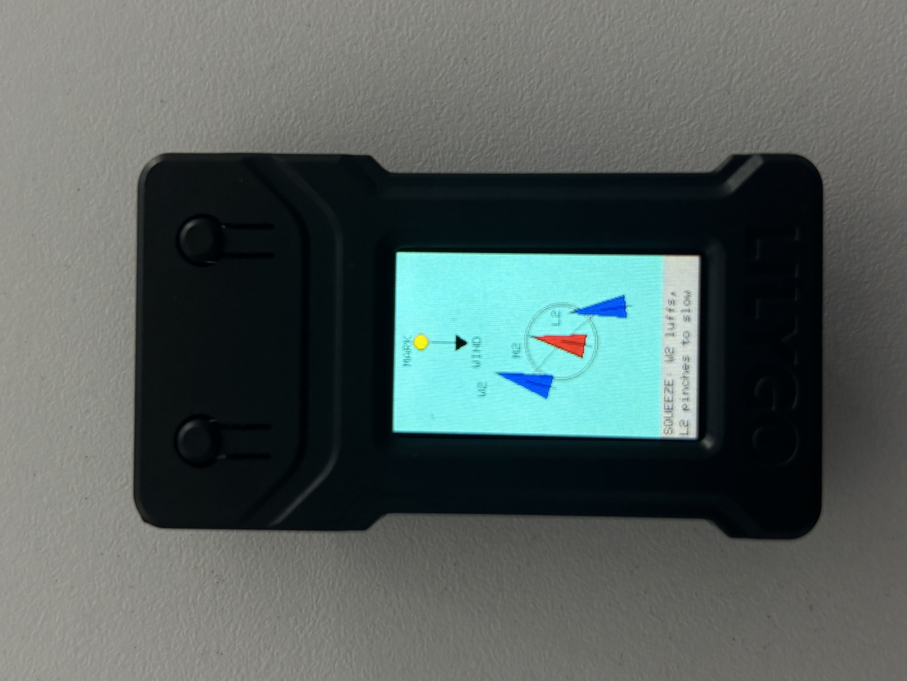
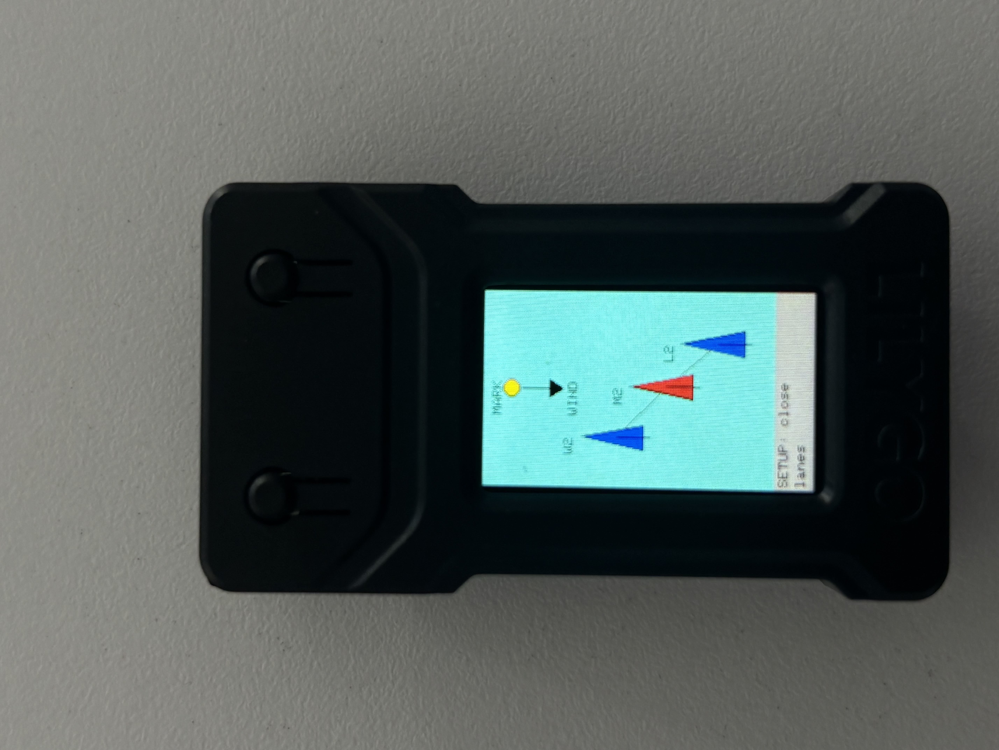

# The Shape of Pressure

An animated sailing tactics display running on an ESP32 TTGO T-Display. The screen shows three boats (W2, M2, L2) sailing upwind toward a mark and loops through the classic **squeeze** maneuver: the windward boat (W2) luffs and the leeward boat (L2) pinches, trapping the middle boat (M2) in dirty air and stalling its progress.

## Display

<table>
  <tr>
    <td></td>
    <td></td>
  </tr>
</table>

## Animation phases

| Phase | Description |
|---|---|
| **SETUP** | Boats in lane, converging toward M2 |
| **SQUEEZE** | W2 luffs, L2 pinches; dirty-air ring appears around M2 |

The cycle repeats every ~4 seconds (120 frames × 33 ms/frame).


## Hardware

- **ESP32 TTGO T-Display** (LilyGo TTGO T1) — ESP32 with a built-in 1.14" ST7789 TFT (135 × 240 px)
- Data-capable USB-C cable


## Software Dependencies

| Tool | Version |
|---|---|
| VSCode | latest |
| PlatformIO extension | latest |
| TFT_eSPI library | ≥ 2.5.43 |
| Arduino framework (via PlatformIO) | bundled |


## Installation

### 1. Install the USB serial driver

**macOS:**
```bash
brew install --cask wch-ch34x-usb-serial-driver
```
Or download from: https://github.com/WCHSoftGroup/ch34xser_macos

Restart your machine after installing.

**Windows:** install the CH340/CH341 driver for your version of Windows.

### 2. Install VSCode + PlatformIO

1. Install [VSCode](https://code.visualstudio.com/).
2. Inside VSCode, install the **PlatformIO IDE** extension: https://platformio.org/install/ide?install=vscode

### 3. Clone this repo and open in VSCode

```bash
git clone https://github.com/ashleyGarcia0405/the-shape-of-pressure
cd testing-board
code .
```

Open the folder in VSCode. PlatformIO should detect `platformio.ini` automatically.

### 4. Install the TFT_eSPI library

From the VSCode integrated terminal:
```bash
pio pkg install -l bodmer/TFT_eSPI
```

Or use the PlatformIO sidebar → Libraries → search `TFT_eSPI` by Bodmer.


## Configuration

`platformio.ini` is already configured for the TTGO T1 board and links the correct display setup header — **no edits needed**:

```ini
[env:ttgo-t1]
platform = espressif32
board = ttgo-t1
framework = arduino
lib_deps = bodmer/TFT_eSPI@^2.5.43

build_flags =
  -D USER_SETUP_LOADED=1
  -include $PROJECT_LIBDEPS_DIR/$PIOENV/TFT_eSPI/User_Setups/Setup25_TTGO_T_Display.h
```

The `build_flags` configure TFT_eSPI for the ST7789 display without modifying library files.


## Build & Upload

Connect the board via USB-C, then either:

**Via PlatformIO sidebar:** click **Build**, then **Upload**.

**Via terminal (my preferred):**
```bash
pio run            # build only
pio run -t upload  # build and flash
```

After upload the display will immediately start the animation.

## Project Structure

```
testing-board/
├── src/
│   └── main.cpp       # All display logic and animation
├── platformio.ini
└── README.md
```

### How the animation works (`src/main.cpp`)

- A `TFT_eSprite` (full-screen off-screen buffer) is drawn each frame and pushed to the display to avoid flicker.
- `drawBoat()` renders a triangle pointing in the boat's heading direction.
- `drawWindFromMark()` draws a downward arrow from the windward mark to indicate wind direction.
- Three boat positions (W2, M2, L2) are linearly interpolated between a spread **State A** and a converged **State B** over 60 frames, then reversed (loop).
- When `t > 0.35`, a dirty-air ring is drawn around M2.
- A footer bar shows the current phase label, word-wrapped to fit the tiny screen.
